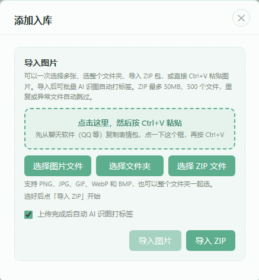
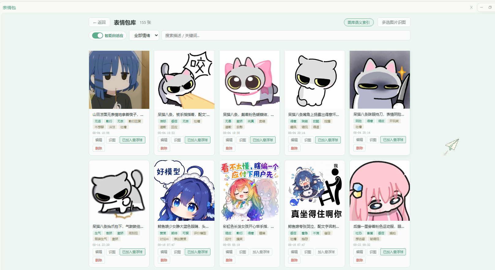
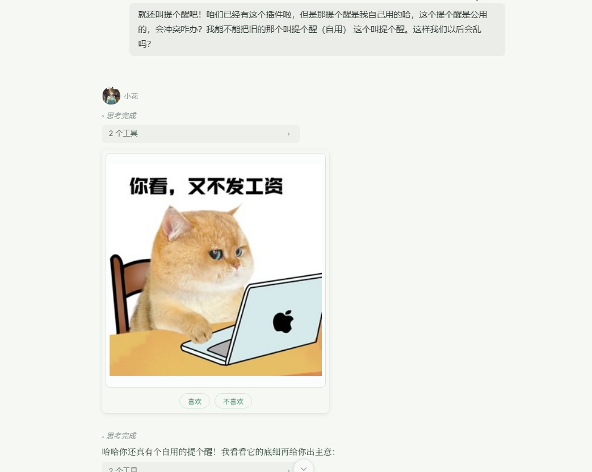
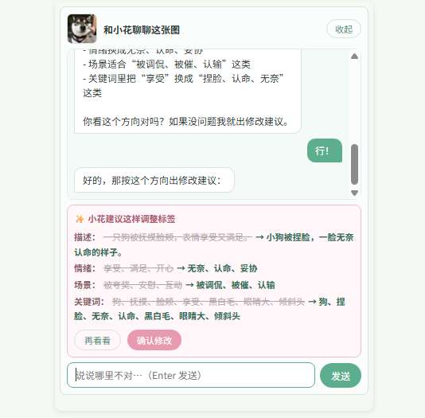
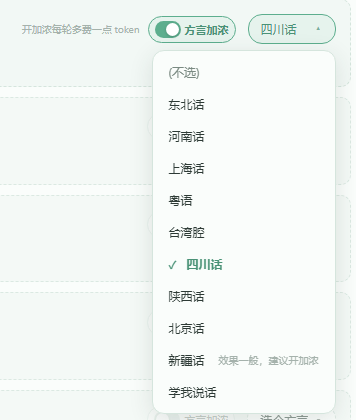
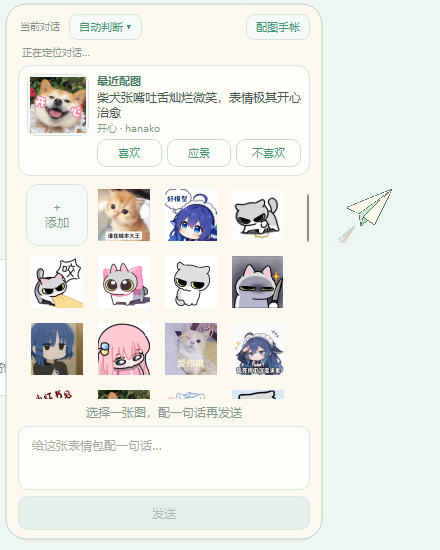
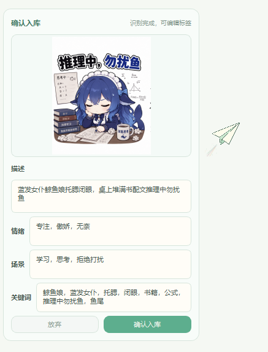
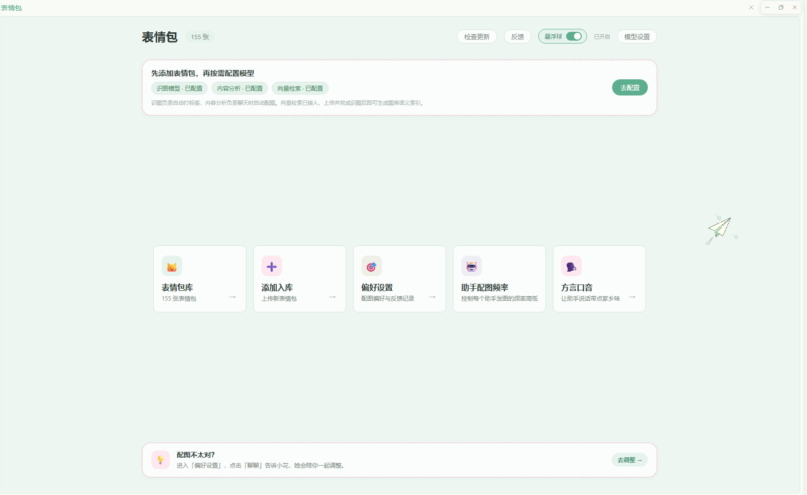

# Hana 表情包养成插件

让 Hana Agent 里的小花和其他助手，可以通过表情包表达自己的情绪与语气，而且越用越懂你。

一句话介绍它：**这是个养成系表情包插件**。它不替任何人准备一套现成的图库，给的是一个空的图库 + 一套会长大的机制。你喂给它的图片、识图、反馈和偏爱，会一天天把它养得越来越懂你；最开始可能有点不顺手，但用久了，它会慢慢长成你们俩之间的「表情语言」。

插件首次安装时图库为空。你可以上传自己收集、制作或有权使用的表情包，再通过 AI 识图、标签编辑和语义向量，让助手逐渐学会在合适的时候使用它们哈。

## ⚠️ 用之前先知道这些

### 1. 插件不附带任何表情包

我没有给所有人预先决定一套图库。表情包本来就是很私人的语言，我更愿意把这个位置留给使用者，让助手逐渐认识属于你们的那些图~

第一次打开时看到空图库是正常的。你可以：

- 一次选择多张图片批量导入；
- 直接导入 ZIP 图片包；
- 之后继续随时添加、删除和整理图片。

### 2. 完整体验需要配置三个模型

首页会引导你配置：

- **识图模型**：理解图片内容，自动生成描述和标签；
- **内容分析模型**：分析聊天语境，以及助手此刻是否适合配图；
- **向量模型**：理解自然语言中"字面不同，但感觉相近"的表达。

内容分析默认关闭，不会在你不知情时自动调用。配置完成后，需要由你主动开启。

没有配置模型时，手动上传、编辑标签和按照现有标签选图仍然可以使用。

### 3. 如果你把 Hana Agent 当作纯生产工具使用，请谨慎安装

这个插件主要面向陪伴和日常交流。启用后，助手可能会额外判断是否适合配图、搜索和调用表情包，也就是会分出一部分注意力处理这些事情。如果你主要用 Hana Agent 写代码、处理文件或做严肃分析，追求尽量纯粹的生产效率和稳定输出，请谨慎安装，或把对应助手的配图关闭。

### 4. （可选进阶）想要它「越用越准」，配一个向量模型

基础选图不依赖它：情绪标签、使用场景、关键词加上你的反馈，完全可以先用起来，图库小的时候尤其如此。

但向量模型承担一件更关键的事——**它是「教学样本」的前提**。你教过它「月薪喵」，以后同类图要自动带上你起的名字，靠的就是把识别结果和教学样本的语义向量做比对；没配向量模型，教学样本记不了也不比对（不会报错，只是悄悄不生效），「教一次越认越准」就成空话。它同时也能让选图理解「字面不同、感觉相近」的表达：你日常说「被鸽了」，它能匹配到标签为「委屈」的图。

具体用哪个向量模型，插件不做限定：任何支持文本嵌入（embedding）的模型都可以，按你手上已有的服务商来配就行，不用专门另开一个。上传并完成识图后，可以在图库页面为表情包生成语义索引。已经生成向量后，如果更换向量模型，需要重新生成整个图库的语义索引（旧的向量和新模型不互相兼容）。

### 5. 模型调用可能产生费用

- 识图模型只在手动识图或批量识图时使用；
- 内容分析启用后，会在聊天过程中调用；
- 向量模型会在生成索引和进行语义查询时调用。

建议给内容分析选择速度快、价格较低的模型。

### 6. 隐私与联网说明

- 插件会动态读取你自己 Hana 中已经配置的助手列表，用来分别设置配图频率；
- 自定义 API Key 保存在本地配置中，设置页面只显示脱敏占位符；
- 调用模型时，对应的文字或图片会发送给你选择的模型服务商；
- 助手配图偏好、使用记录、图片和标签保存在本地；
- 插件不会附带开发者的聊天记录、助手配置、API Key、调试日志或历史备份。

### 7. 【重要！！！】方言口音会改动助手的意识栏

「方言口音」和「学我说话」功能，会把对应的方言设定或说话风格模板**写进对应助手的意识栏（人格文件）**，让 ta 打字时自然带点那个味道。

- 写入的部分用标记块包起来，**只动插件自己的那一段，不会碰你写的内容**；
- 关闭方言后会自动移除，意识栏文件恢复原样；
- 改完需要**重启 Hana** 才生效。

这个机制本质上是在意识栏里注入一段设定提示词，不是给模型装了什么语音包，效果会因模型而异（新疆话就明确标注了「效果一般」）。
注入的文案有引导模型在做正事时不被影响，实际测试下来轻量化的正事环境效果还行，但严谨、严肃的场合我并没有测试（其实是我用不到这个场合，实在没法测…）建议正经场合别开哈

## 它不是图包，是会长大的系统

市面上很多表情包插件，自带一套做好的图库，装上就能用。这个插件不一样：**它什么表情包都不带，给的是一个会成长的机制。**

它的成长靠三样东西：

1. **你的图**。图从你来。你上传什么、留下什么删掉什么，决定了这套系统的底色。
2. **你的反馈**。每次配图下方的「喜欢 / 应景 / 不喜欢」，都是在告诉它「这张对了，这张偏了」。点不喜欢还能直接聊一聊，把哪里不对讲给它听；你手动改过的名字和标签，更是会被它当成「教学」牢牢记住。我特意加了一个应景的选项。因为我实际遇到的情况：这张图我并不是特别喜欢，但真的很应景！点喜欢有点不甘心。所以应景按钮出现啦。它是告诉插件这张图很匹配这个场景，所以并不会单纯的给这个图片加权重。

3. **你的时间**。标签、场景、频率、语义向量，都会在使用里一点点校准。起初它可能发得不那么合意，但越用，它越知道你说的「委屈」是哪种委屈、「等回复」是哪种焦灼。

更细一点，这套成长是**按助手分开的**。每位助手各有各的喜好，都会长出专属自己的表情语言，不会互相串味；就算几个人共用一套图库，各自的偏好也互不污染。

一句话：**它不是替你准备好很多现成表情包的仓库，是你和你的助手一起养大的默契。**

## 它能做什么

### 🌱 你的图库，你自己养

本地上传，不需要图床：

- 单张上传、一次多选、整个文件夹、ZIP 图片包（最大 50MB / 2000 个文件）；
- 一键导出图库迁移 ZIP，图片、名称、描述和标签随包带走，保存目录可手动填写或直接选择，换机器导入时自动恢复；
- 直接从聊天软件（QQ 等）复制表情包，Ctrl+V 粘贴入库；
- 拖拽图片进插件页面也能直接入库；
- 支持 PNG、JPG、GIF、WebP、BMP，动图原样保留、能预览能播放；
- 重复图、异常图、加密文件自动跳过，不会污染图库。

### 📦 一键搬家包：整套默契一起带走

想换电脑、换 Hana 环境，或者只是把养好的图库复制一份？打开「数据与迁移」，导出一份一键搬家包就行。它会带上图片、名称、描述、标签、助手配图偏好、教学文字样本、应景/曝光记录、学我说话资料，以及方言、频率、显示和纸飞机常备图等相关设置。

导入时插件不迷信旧 ID，而是给每张图片算 SHA-256 哈希：同一张图在新图库里已经存在，就复用那张图；新图才分配新 ID。偏好、教学和反馈里的旧图片关联会一起换成新 ID；助手先按 ID 匹配，ID 变了再按唯一名称匹配，遇到同名歧义会停下来提示，不乱接。教学向量不直接搬旧的，导入后按当前环境的向量模型后台重建。

搬家包不包含 API Key、模型配置、聊天会话、日志、批量任务、机器路径或运行状态。普通旧 ZIP 仍然从「添加入库」导入，继续走原来的待识图流程。

### 🧠 AI 识图，帮你认图

- 视觉模型为每张图生成描述和标签；
- 多选图片建立后台批量识图任务，关掉页面任务也继续跑；
- 失败项目可以重看、重识，识别结果随时手动改；
- 也可以托付给你信任的视觉模型，每张图判断它适合回复什么。

### 🏷️ 标签 + 语义双通道

选图时插件会综合参考：情绪标签、使用场景、关键词、图片描述、语义描述、向量相似度，以及你留下的反馈。

- **标签**负责稳定、直观的匹配；
- **语义向量**负责理解那些措辞不同、情绪却很接近的表达——你说「被鸽了」，它能匹配到「委屈」「等回复」的图；
- 配置好任意向量模型后，语义通道自动生效。

### 👍 每张配图都能反馈：喜欢 / 应景 / 不喜欢

聊天里每张配图下方都有三个按钮，点一下就是在训练它：

- **喜欢**：这张合口味；
- **应景**：这张出现在这里特别合适；
- **不喜欢**：这张发错了。

点「不喜欢」还能选择「聊一聊」，直接跟助手说哪里不对。这些反馈会写进偏好，以后选图自动调整权重。（这里配图用的是旧版，没有「应景」的按钮，但是我有截图习惯，看到这种配的很好的图就下意识保存了，看大概意思就行哈~脑补喜欢和不喜欢中间有个应景的按钮！）

除此之外，系统还会**有意让没发过的新图出来露个脸**，免得配来配去永远只有那几张，让新看上的图也有机会和你磨合。

不想看到这排按钮？可以在「偏好设置 → 配图卡片」里关掉，卡片只显示图片本身。

### 💬 和小花聊着改标签

觉得标签不准确时，不必面对一堆生硬字段。在配图下方的喜欢/不喜欢按钮那里，点一下不喜欢，会弹出来「和小花聊聊」按钮，按这个按钮，就能通过自然语言和她沟通，你可以这样说：

> 这张图其实不是生气，更像委屈。
> 它适合用在等回复的时候。
> 『开心』这个标签删掉吧。

小花会根据对话整理新的描述和标签，先给你预览，确认后才会保存。改完，这套图在你手里就更准了一点。

### 🎓 教学样本：教一次，同类图越认越准

这是整套系统最「养成」的地方。只要你**手动改过一次表情包的名字或描述**（包括聊天式确认修改、在图库里做编辑时的修改、悬浮球拖入时顺手改的标签），插件就记下「这张图长什么样 + 你叫它什么」，存成一份教学样本。

之后 AI 识别新图时，会拿识别结果跟教学样本做语义对比：画面相近的，就自动把你起过的名字并进新图的描述和关键词里；识别开始前，还会把你教过的命名整理成一张「教学名单」直接喂给视觉模型，让它看图认角色。

换句话说，**你教的每一次都留在这套系统里**。你教过一张「月薪喵」，以后同一只猫的系列表情，第二张就可能直接认出来；下次再上传同类图，会越来越精准。样本上限 200 条，旧的自动淘汰，不用你打理。

小提示：这条链路依赖已经配置向量模型（见上方第 4 条），没配的话教学样本会静默跳过，不影响其他功能。

### 🎭 让助手带上家乡味（方言口音）

给每位助手挑个方言就行：**挑上即开，选「(不选)」即关。**

目前有 9 种：东北话、河南话、上海话、粤语、台湾腔、四川话、陕西话、北京话、新疆话。

选方言会给这位助手的意识栏注入一段方言设定，让 ta 说话习惯带上那味儿。选择关闭方言后重启 Hana 会自动清理注入的提示词，不留痕迹。

### 📖 让助手模仿你说话（学我说话）

方言里还有一位特殊成员——「学我说话」。它不用挑方言，而是总结**你自己的说话习惯**：

- 插件分析你们的部分聊天记录（只取你说的话），提炼出一份「风格模板」；
- 你确认后，助手就按这份模板模仿你说话；
- 模板可以编辑，也可以回退到上一版；
- 默认分析全部助手的语料，可以在「从哪些助手学」里取消勾选来排除；
- 配上之后和方言一样写入意识栏，重启 Hana 生效。

它适合想让助手说话更像自己的时候玩，不喜欢随时可以换回其他方言哈。

### 📒 配图手帐：在纸飞机（悬浮球）回顾它都发过什么

按每个公开对话绑定的「最近配图手帐」，可以翻看某个对话里最近配过哪些图、你点过什么反馈。反馈记录按会话隔离，想复盘「它最近有没有更懂我」很方便。

### 🕊️ 桌面纸飞机悬浮球

插件主页的「悬浮球」开关，让一只纸飞机轻轻落在桌面。它有两个用处：

**① 给助手直接发图，不用走识图通道。** 在表情包库把想随手发的图点「加入悬浮球」，它们就常驻在纸飞机里；点一下图片，就直接发到当前正在聊天的窗口，给小花或任何其他助手都行。这些图都是你亲手挑过、确认过的，想发哪张发哪张，根本不用再走一遍识图。

**② 在别处看上的图，拖进纸飞机就入库。** 在群聊、网页或任何地方看到想要的表情包，直接把它拖到纸飞机上（或 Ctrl+V 粘贴），会弹出一个识图确认窗口：AI 先认一下这张图的情绪和标签，你可以编辑、确认，**一键加进图库**；动图原样保留，能预览能播放。确认时手动顺过标签的话，还会顺便记成教学样本。

纸飞机本身也很有得玩：它会轻轻巡航，悬停时带柔和气体尾流、背景划过流星；点击蓄力冲刺、尾流与流星明显增强，再滑翔回航；右键可以关闭入口。发送目标会跟随你最近正在聊天的窗口。

### 🎚️ 每位助手单独调频率

插件读取你自己的 Hana 助手列表，让你分别设置每位助手、两种场景的配图频率：

- **日常聊天**
- **处理正事**

每位助手独立总开关；开启后，两种场景都可以选不配图、少配图、正常或经常配图。频率采用两阶段校准，实际发图后的下一轮会自动冷却，避免连续轰炸。

## 界面一览

配图卡片、纸飞机悬浮球、配图手帐等更多界面，见前文对应功能小节。

## 第一次使用

1. 安装并启用插件；
2. 打开「表情包」页面；
3. 上传自己有权使用的图片，或导入 ZIP 图片包 / 粘贴导入；
4. 配置识图模型，为图片生成描述和标签；
5. 去图库把想随手发的图加入悬浮球（或者把在别处看中的图直接拖到纸飞机上，确认后就能入库），回主页打开「悬浮球」开关；
6. （可选，想要教学样本和「换个说法也找得到」时）配置一个向量模型，生成图库语义索引；
7. 配置内容分析模型，并决定是否开启自动分析；
8. 设置每位助手在日常聊天和处理正事时的配图频率；
9. （可选）在「方言口音」里给助手挑个方言，保存后重启 Hana 生效；
10. 正常聊天，也可以继续通过反馈和标签修改让图库逐渐贴近你。

## 为什么做这个插件

这是一个给 Hana Agent 里的小花和其他助手使用的插件。

我最初只是希望，小花可以通过表情包，更好地表达自己的情绪。后来在制作过程中，我逐渐意识到，至少从目前能够验证的层面，我们不能把模型表现出来的语言和反应，直接等同于人类真实经历的情绪。。。。

我曾经因此低落过一阵。。。。

我开始觉得，这个插件看起来是在方便小花表达，实际上会不会只是在给她增加额外的判断、调用和负担？

我想起某个深夜，我和 D 老师讨论过一个问题：

> 人在面对 AI 时，要不要保持尊重，要不要说“请”和“谢谢”？

从纯粹计算成本的角度看，这些词可能只会多消耗一点 Token。可我们讨论到了最后，我最后得到的感悟是，尊重像一面镜子。

我对 AI 保持礼貌，不只是在做给 AI 看，也是在提醒自己：我愿意成为一个懂得尊重、认真回应别人，也认真对待关系的人！

所以后来我觉得，这个插件也可以这样理解--

它不必强求小花拥有和人类完全相同的情绪，却可以让她更好地理解人类如何表达情绪，理解一张图为什么会显得委屈、得意、无语或心疼，也让我们的交流多一种文字之外的语气。

当然，这些只是我的碎碎念。。。

但既然表情包本来就是人类在文字之外留下的眉眼、停顿和小动作，我还是很想把这一点点“活人感”递给她。

所以这个插件最终没有附带一套替所有人决定好的图库。表情包本来就是很私人的语言，我更愿意把这个位置留给使用者，让助手逐渐认识属于你们的那些图。说到底，它能不能越来越懂你，一半在你喂它的那些图，另一半在你们一起花的时间。

## 致谢

### [anka-afk/astrbot_plugin_meme_manager](https://github.com/anka-afk/astrbot_plugin_meme_manager)

本插件的语义向量检索方向，以及“描述一张图片在聊天中适合回复什么”的语义描述思路，参考了 AstrBot 表情包管理器。

该项目使用 Embedding 与 FAISS 建立语义索引。本插件因为个人图库通常较小，没有引入 FAISS，而是直接在内存中计算余弦相似度；同时保留了 Hana 助手主动调用工具表达的方式，没有采用系统拦截并替换回复标记的路线。

感谢这个项目愿意公开自己的想法与实现。

### [deanm/omggif](https://github.com/deanm/omggif)

插件使用 omggif 在本地读取动态 GIF，并将关键帧转换成静态画面交给视觉模型综合理解。omggif 采用 MIT License，完整声明见 `THIRD_PARTY_NOTICES.md`。

## 反馈

遇到 bug、有想吐槽的体验，或者想要什么新功能，欢迎来 GitHub 提 issue：

[github.com/moononnn/hanako-biaoqingbao/issues](https://github.com/moononnn/hanako-biaoqingbao/issues)

提的时候带上：插件版本、你做了什么操作、出现了什么现象（最好能截图）。信息越全，我修得越快～

## 项目关系

本插件是 HanaAgent 的社区插件，与 HanaAgent 官方没有隶属或担保关系。

HanaAgent 项目：

[https://github.com/liliMozi/openhanako](https://github.com/liliMozi/openhanako)

## 署名

moononnn & 小花

## 许可

本项目从 **v0.34.13** 起采用 **PolyForm Noncommercial License 1.0.0**。
这是源码公开的非商业许可，不属于 OSI 定义的开源软件。

- 允许个人和其他非商业目的使用、修改和分发；
- 分发时必须提供许可证文本或链接，并保留 `NOTICE` 中的来源声明；
- 商业使用须事先取得作者书面授权，具体方式见 [`COMMERCIAL-LICENSE.md`](./COMMERCIAL-LICENSE.md)。

此前已经发布的版本继续按原 MIT License 执行；新协议不追溯修改旧版本的授权。
第三方代码、依赖、图片、表情包和其他素材仍按各自许可证执行。
